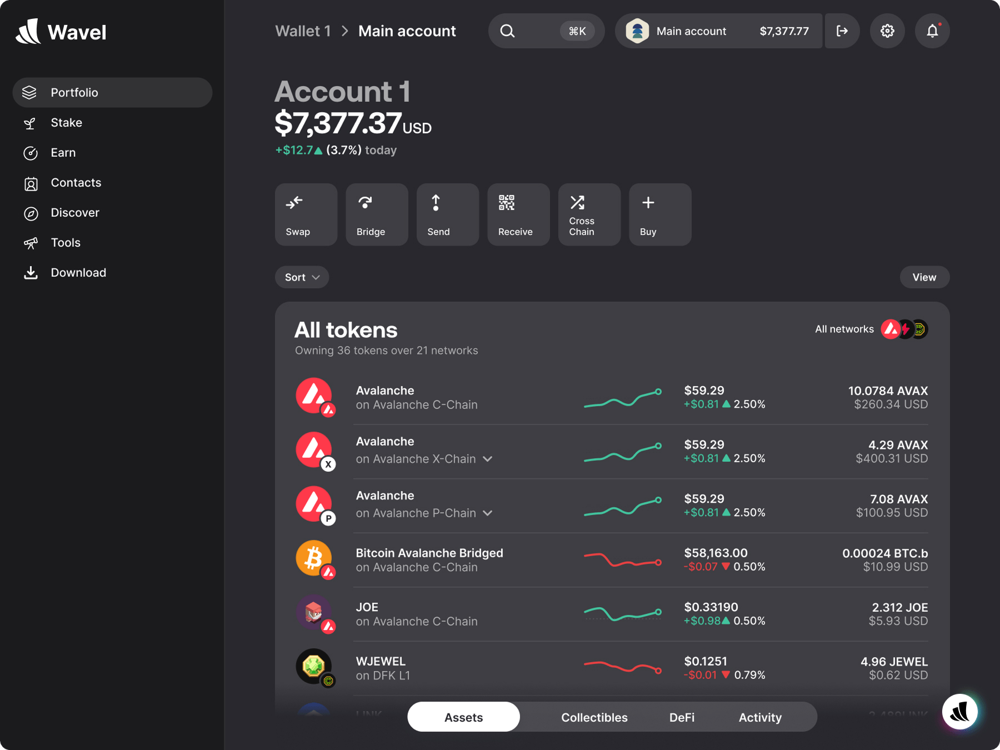
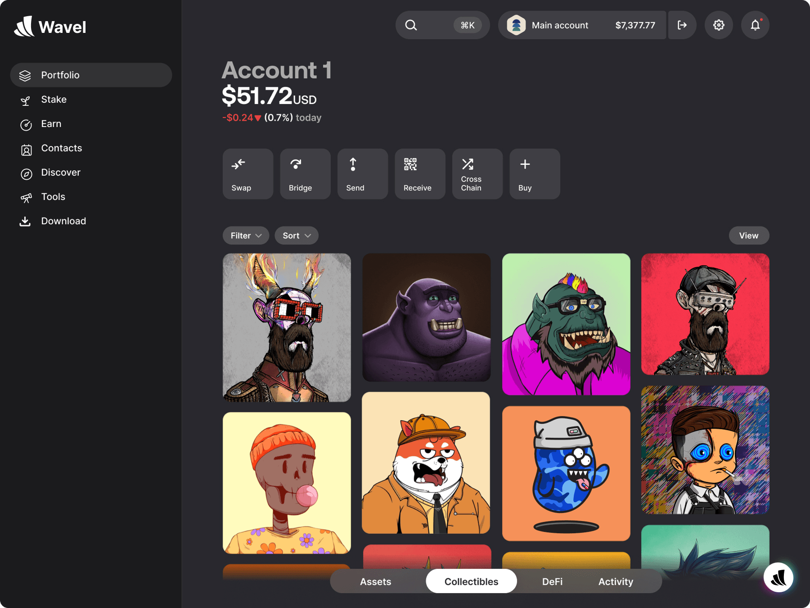

<div align="center">
  
  <h1>Wavel Wallet</h1>
  <a href="LICENSE"></a>
</div>

<p align="center">
  
  
</p>

## Application Source

This repository contains the implementation of a future Electron desktop wallet with:

- BIP-39 wallet creation/import and standard EVM derivation at `m/44'/60'/0'/0/0`
- A versioned local vault encrypted with scrypt and AES-256-GCM, with that encrypted
  payload wrapped by Electron `safeStorage` when the OS supports it
- Ethereum, Base, Arbitrum One, Optimism, and Polygon native balances and transfers
- Replaceable, keyless RPC endpoints with chain-ID verification
- Fee estimation followed by an explicit, expiring confirmation before local signing
- Receive/address copy, manual lock, and configurable automatic lock
- Sandboxed renderer, context isolation, strict CSP, allowlisted typed IPC, no Node.js
  renderer integration, no remote application content, and no telemetry

The MVP does not display tokens or transaction history, connect to dApps or hardware
wallets, simulate transactions, manage multiple accounts, or update itself. The Windows
installer is currently unsigned. There has been no independent security audit.

## Build And Run

Requirements: Node.js 22, npm 10, and Windows 10/11 for the packaged application.

```powershell
npm ci
npm run typecheck
npm test
npm run build
npm run dev
```

`npm run dev` builds local source and opens Electron. It does not load a remote dev
server. Wallet data is stored under Electron's per-user application data directory,
not in the repository.

## Local Package

Developers can optionally create an unsigned local NSIS package for testing:

```powershell
$env:CSC_IDENTITY_AUTO_DISCOVERY="false"
npm run dist:win
```

Artifacts are written to `release/` and are ignored by Git. They are development
artifacts, not official downloads or releases. No installer is published by this
repository.

## Security Design

Key generation, vault decryption, derivation, signing, and RPC access run in Electron's
main process. The renderer receives only public wallet state and prepared transaction
details. The sole exception is onboarding: a newly generated mnemonic crosses the
narrow preload bridge once for display, while an imported phrase exists in its input.
No mnemonic/private-key export API exists.

The vault always requires the user's password. `safeStorage` wraps the password-encrypted
payload with OS-account-bound protection when available; it does not replace the
password layer or store a separately recoverable mnemonic. JavaScript runtimes
cannot guarantee complete zeroization of immutable strings, crash dumps, or copied
memory. Locking discards wallet object references and pending confirmations, but this
limitation remains part of the residual risk.

Default public RPC providers receive the selected public address, IP address, and RPC
requests. They never receive private keys or recovery phrases. Public endpoints may be
rate-limited or unavailable. Custom RPC URLs must use HTTPS (except localhost) and may
not contain credentials, query parameters, or fragments so API secrets are not stored.

See [Security Model](docs/SECURITY-MODEL.md), [Architecture](docs/ARCHITECTURE.md), and
[Security Policy](SECURITY.md). Report vulnerabilities privately as described there.

## Repository Map

```text
src/main/        Electron lifecycle, vault, wallet, RPC, signing, IPC
src/preload/     Narrow contextBridge API
src/renderer/    Local Vite/TypeScript interface
src/shared/      Typed IPC contract
scripts/         Local build helpers
.github/         Continuous integration checks
docs/            Product, architecture, network, and security documents
```

## Network Defaults

| Network | Chain ID | Native asset | Default RPC |
| --- | ---: | --- | --- |
| Ethereum | 1 | ETH | `https://ethereum-rpc.publicnode.com` |
| Base | 8453 | ETH | `https://mainnet.base.org` |
| Arbitrum One | 42161 | ETH | `https://arb1.arbitrum.io/rpc` |
| Optimism | 10 | ETH | `https://mainnet.optimism.io` |
| Polygon | 137 | POL | `https://polygon-bor-rpc.publicnode.com` |

These are third-party public services, not Wavel infrastructure or endorsements.

## License

Wavel Wallet source and documentation are available under the [MIT License](LICENSE).
Network names and third-party trademarks belong to their respective owners.
